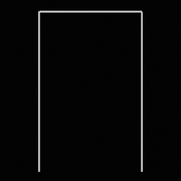
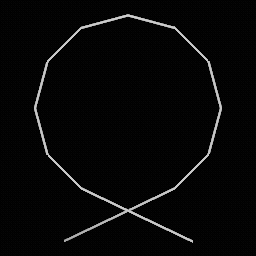
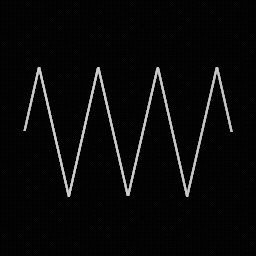
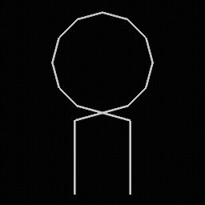
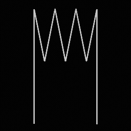
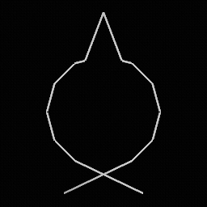
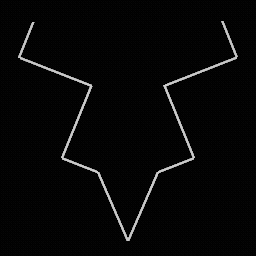
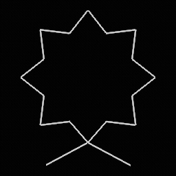

# FSL - Obstacle Course Data

**SYSTEM3.FSL** is the main script file that Vib-Ribbon uses to control obstacles and other on-screen effects during gameplay. There are 6 exact copies of this file on the PAL disk, one for each language:

* GAME/01_FILES.PAK/SCRIPT/SYSTEM3.FSL (Japanese)
* GAME/02_FILES.PAK/SCRIPT/SYSTEM3.FSL (English)
* GAME/04_FILES.PAK/SCRIPT/SYSTEM3.FSL (German)
* GAME/08_FILES.PAK/SCRIPT/SYSTEM3.FSL (Spanish)
* GAME/10_FILES.PAK/SCRIPT/SYSTEM3.FSL (French)
* GAME/20_FILES.PAK/SCRIPT/SYSTEM3.FSL (Italian)

## File Layout

SYSTEM3.FSL is composed of 7 sections of data in order as follows:

* [Header](#header): Stores the size of each table and other parameters.
* [Fixed Pattern Table](#fixed-pattern-table): Lookup table of patterns that send obstacles in a fixed, repeating order.
* [Distribution Pattern Table](#distribution-pattern-table): Lookup table of patterns that send obstacles in random order with a given seed and distribution.
* [Control Segment Table](#control-segment-table): Time segments for each track that control the speed and gap between obstacles.
* [Pattern Segment Table](#pattern-segment-table): Time segments for each track that determine which pattern to use for a section of obstacles. Each segment points to an index in either the fixed pattern table or distribution pattern table.
* [Event Segment Table](#event-segment-table): Time segments for each track that trigger camera events and other miscellaneous effects.
* [Track Index Table](#track-index-table): Assigns each track an index in the control, pattern, and effect segment tables.

The system file contains a total of 7 tracks, including 2 tracks for each of the main courses (Bronze, Silver, Gold), and one very large track for custom CDs. Tracks are always stored in the following order:

* Track 0: Polaroid (Bronze)
* Track 1: Sunny Day (Bronze)
* Track 2: Laugh & Peace (Silver)
* Track 3: Universal Dance (Silver)
* Track 4: Overflowing Emotions (Gold)
* Track 5: Roll Along (Gold)
* Track 6: Custom CD

When playing a standard course, the game starts at time `0x0` and locates the first time segment in each of the control, pattern, and event segment tables for the current track. These time segments control different parameters during gameplay such as the pattern to spawn obstacles, how fast these obstacles move toward Vibri, and the camera angle for a particular section. As time passes, time segments in each of the three tables advance in parallel until the track ends.

When playing a custom CD, the game will select a random start time between `0x0` and `0x5D5DDB0` for one track. The game then starts playing time segments in order from that starting position. If the CD has multiple tracks, each track will be assigned a random index in an array of start times.

The custom CD track orders times segments in each table from lowest to highest difficulty. This means that a CD with several tracks can get a mix of easy and hard courses, but the difficulty may jump around between tracks.

### Header

Starts at byte offset `0x00`.

| Offset | Type | Name | Notes |
|-|-|-|-|
| 0x00 | uint32 | controlSegmentTableCount | Number of tracks in the [Control Segment Table](#control-segment-table). |
| 0x04 | uint32 | patternSegmentTableCount | Number of tracks in the [Pattern Segment Table](#pattern-segment-table). |
| 0x08 | uint32 | eventSegmentCount | Number of tracks in the [Event Segment Table](#event-segment-table). |
| 0x0C | uint32 | trackIndexTableCount | Number of tracks in the [Track Index Table](#track-index-table). |
| 0x10 | uint32 | fixedPatternTableCount | Number of entries in the [Fixed Pattern Table](#fixed-pattern-table). |
| 0x14 | uint32 | distributionPatternTableCount | Number of entries in the [Distribution Pattern Table](#distribution-pattern-table). |
| 0x18 | uint32 | unk1 | Possibly number of standard tracks (6). |
| 0x1C | uint32 | unk2 | |
| 0x20 | uint32 | unk3 | Possibly number of custom CD tracks (1).|
| 0x24 | uint32[] | unkArray | Possibly array of indices for all tracks. Total size is `unk1` + `unk2` + `unk3` |

### Fixed Pattern Table

Lookup table of obstacle patterns shared by all tracks. Each pattern plays in a fixed order and repeats while the current pattern segment is active. Starts at byte offset `0x40`.

| Offset | Type | Name | Notes |
|-|-|-|-|
| 0x00 | FixedPattern[] | patternArray | Size is given by `Header.fixedPatternTableCount` |

#### `FixedPattern`

| Offset | Type | Name | Notes |
|-|-|-|-|
| 0x00 | uint32 | count | |
| 0x04 | ObstacleEnum[] | obstacleArray | Each value corresponds to one obstacle in [`ObstacleEnum`](#obstacleenum) |

#### `ObstacleEnum`

| Value | Obstacle | Image |
|-|-|-|
| 0x00 | Block |  |
| 0x01 | Pit |  |
| 0x02 | Loop |  |
| 0x03 | Wave |  |
| 0x04 | Block + Pit |  |
| 0x05 | Block + Loop |  |
| 0x06 | Block + Wave |  |
| 0x07 | Pit + Loop |  |
| 0x08 | Pit + Wave |  |
| 0x09 | Loop + Wave |  |

### Distribution Pattern Table

Lookup table of obstacle patterns shared by all tracks. Each pattern sends obstacles in pseudo-random order. The pattern contains a fixed seed used to generate the sequence of obstacles. This ensures that the track plays the same way each time. Starts at byte offset `0xEC`.

| Offset | Type | Name | Notes |
|-|-|-|-|
| 0x00 | DistributionPattern[] | patternArray | Size is given by `Header.distributionPatternTableCount` |

#### `DistributionPattern`

| Offset | Type | Name | Notes |
|-|-|-|-|
| 0x00 | uint32 | count | Always 1, except for the last pattern? |
| 0x04 | int32 | randomSeed | |
| 0x08 | int32 | maxProb | |
| 0x0C | int32[] | obstacleProb | Array of 10 elements, one for each value in [`ObstacleEnum`](#obstacleenum) |

The distribution is calculated as follows:

* For `i = 0` (Block), `P(0) = obstacleProb[0] / maxProb`.
* For `i > 0`, `P(i) = (obstacleProb[i] - obstacleProb[i-1]) / maxProb`

For example, given `maxProb = 6` and `obstacleProb = [0, 0, 1, 2, 2, 2, 2, 4, 6, 6]`:

* `P(Loop) = P(Wave) = 16.6667%`
* `P(Pit + Loop) = P(Pit + Wave) = 33.3333%`

### Control Segment Table

Contains a list of time segments for each track. Each segment controls the speed of obstacles for a particular section of the track, as well as the minimum gap (a.k.a. "shadow period") between obstacles. Starts at byte offset `0xDB8`.

| Offset | Type | Name | Notes |
|-|-|-|-|
| 0x00 | ControlSegmentTrack[] | tracks | Size is given by `Header.controlSegmentTableCount` |

#### `ControlSegmentTrack`

Stores a list of control segments for a single track.

| Offset | Type | Name | Notes |
|-|-|-|-|
| 0x00 | uint32 | segmentCount | |
| 0x04 | ControlSegment[] | segments | Segments are sorted by `startTime` |

#### `ControlSegment`

Each segment is `0x14` bytes in length.

| Offset | Type | Name | Notes |
|-|-|-|-|
| 0x00 | int32 | startTime | |
| 0x04 | int32 | baseSpeed | Larger value = slower. Minimum value is `0x40` before the game crashes. |
| 0x08 | int32 | baseShadowPeriod | Larger value = longer minimum gap between obstacles. |
| 0x0C | int32 | deltaSpeed | |
| 0x10 | int32 | deltaShadowPeriod | |

Both the obstacle speed and shadow period can gradually increase or decrease to match the speed of the song. Given a time value `t`, both are calculated as:

* `speed = baseSpeed + (t - startTime) * deltaSpeed / 4096`
* `shadowPeriod = baseShadowPeriod + (t - startTime) * deltaShadowPeriod / 4096`

### Pattern Segment Table

Contains a list of time segments that determine obstacle patterns for each track. Starts at byte offset `0x56CC`.

| Offset | Type | Name | Notes |
|-|-|-|-|
| 0x00 | PatternSegmentTrack[] | tracks | Size is given by `Header.patternSegmentTableCount` |

#### `PatternSegmentTrack`

Stores a list of pattern segments for a single track.

| Offset | Type | Name | Notes |
|-|-|-|-|
| 0x00 | uint32 | segmentCount | |
| 0x04 | PatternSegment[] | segments | Segments are sorted by `startTime` |

#### `PatternSegment`

Each segment is `0x10` bytes in length.

| Offset | Type | Name | Notes |
|-|-|-|-|
| 0x00 | int32 | startTime | |
| 0x04 | int32 | unk | Does not appear to be used in-game. |
| 0x08 | int32 | patternType | 0 = None (break) 1 = Fixed pattern 2 = Distribution pattern |
| 0x0C | int32 | index | Index into pattern table given by `patternType`. If -1, no pattern is active. |

A `patternType` of 0 indicates a break in the song. This triggers the camera to spin around Vibri.

The custom CD track does not contain any break segments. Instead, the game will insert breaks into the song automatically.

### Event Segment Table

Contains a list of time segments that activate miscellaneous effects. Starts at byte offset `0x5EC8`.

| Offset | Type | Name | Notes |
|-|-|-|-|
| 0x00 | EventSegmentTrack[] | tracks | Size is given by `Header.eventSegmentTableCount` |

#### `EventSegmentTrack`

Stores a list of event segments for a single track.

| Offset | Type | Name | Notes |
|-|-|-|-|
| 0x00 | uint32 | segmentCount | |
| 0x04 | EventSegment[] | segments | Segments are sorted by `startTime` |

#### `EventSegment`

Each segment is `0x18` bytes in length. Events are independent objects, and as such their durations may last longer than the current segment.

| Offset | Type | Name | Notes |
|-|-|-|-|
| 0x00 | int32 | startTime | |
| 0x04 | int32 | randomSpeedEventDuration | See [Random Speed Event](#random-speed-event). |
| 0x08 | int32 | randomSpeedEventParam | See [Random Speed Event](#random-speed-event). |
| 0x0C | int32 | unusedDuration | Always 0. Has no effect. |
| 0x10 | int32 | flipEventDuration | See [Flip Event](#flip-event). |
| 0x14 | int32 | cameraEvent | Index = `cameraEvent % 10` Loop count = `cameraEvent / 10` See [Camera Event](#camera-event). |

##### Random Speed Event

Sends obstacles at random speeds. Similar to `ControlSegment`, a higher speed value indicates a slower obstacle. This effect changes depending on the value of `randomSpeedEventParam`:

* `0x02`: Select a random speed using `startTime` as the seed for the first obstacle. Probabilities are: `P(0x8000) = P(0x14000) = 30%, P(0xAAAA) = 40%`
* `0x03`: Select a random speed using `startTime` as the seed for the first obstacle. Probabilities are: `P(0x8000) = P(0x14000) = 50%`
* `0x16`: Cycle speeds between `0x8000` -> `0x14000` -> ...
* `default`: Cycle speeds between `0xAAAA` -> `0x8000` -> `0x14000` -> ...

##### Flip Event

Spawns obstacles upside-down that flip into place as they approach Vibri.

##### Camera Event

Sets the camera angle for the segment. The camera index points to an [.ANC](../anc) file in the "GAME/\*_FILES.PAK/ROAD/" folder:

| Camera Index | Camera Name |
|-|-|
| 0x01 | B01 |
| 0x02 | B02 |
| 0x03 | S01 |
| 0x04 | S02 |
| 0x05 | F01 |
| 0x06 | F02 |
| 0x07 | F03 |

The camera loop count determines the speed of the camera animation. A higher value indicates a faster playback speed.

### Track Index Table

Assigns a control, pattern, and event segment table index to each track. Starts at byte offset `0x68D4`.

| Offset | Type | Name | Notes |
|-|-|-|-|
| 0x00 | TrackIndexEntry[] | entries | Size is given by `Header.trackIndexTableCount` |

#### `TrackIndexEntry`

| Offset | Type | Name | Notes |
|-|-|-|-|
| 0x00 | uint32 | controlSegmentIndex | Index into the [Control Segment Table](#control-segment-table). |
| 0x04 | uint32 | patternSegmentIndex | Index into the [Pattern Segment Table](#pattern-segment-table). |
| 0x08 | uint32 | eventSegmentIndex | Index into the [Event Segment Table](#event-segment-table). |
