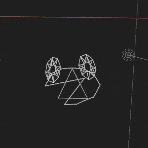

# TMD - PlayStation Model

Like every three-dimensional object in a video game, a character, such as Vibri, would need a 3d model in order to convey what the player is doing. Despite previous confusion within the confines of the Vib-Ribbon community, this is no exception for Vibri. The format in which Vib-Ribbon uses for its models is the TMD format, which is useful for being able to be integrated in system memory. These files tend to be small to the point where multiple tens, or maybe even a couple hundred could theoretically fit inside the base 2 megabytes of system memory on the PlayStation.

Vib-Ribbon makes use of these model files rather extensively compared other games due to the visual style of the game. From characters, to the ribbon itself, to even the font that the game uses, everything that is a vector traces back to one of these models. However, if imported straight into a program, such as Blender, you’ll only get pieces of a model that aren’t put together. It’s up to the ANM files to put them together.

And because of the fact that the objects that make up each file are polylines, as opposed to polygons, they may render as invisible or otherwise incorrect or strange unless the user turns out some sort of wireframe mode.

## File Makeup

| Header | Object Table | Primitives | Vertexes | Normals |
|:------:|:------------:|:----------:|:--------:|:-------:|

## TMD Applications
### Vibri

There are two variants of Vibri's rabbit form inside of the games files. These two files only contain Vibri’s rabbit form, as her other forms are located in other files. One of them is located in `TITLE\FILES\MOVIE\TITLE`, which is a 8120-byte file named `VIBRI.TMD`. It is used for the title screen, menus, and the tutorial. Essentially, any non-game setting may use this model rather than the other. A major difference to be known from the other models is that this one is not meant to be looked at from all directions, as this model takes a slightly more "two-dimensional" approach.

However, taking the camera to a different position reveals a few things about Vibri that suggest that the third dimension was used to help make certain details.

</img>
 

 Certain angles are still applied to some of the limbs of Vibri. In the example gif for example, you can notice how her feet and her arms are tilted, which is usually not though about when rendered into the game. Her torso is also a full cone-like structure rather than a plane like the rest of the model's objects.
  
Perhaps the most noticable, her eyes also pertrude from the rest of the face, likely as either a way to make them appear thinner than they really are, or to make them scale more naturally when turning. A final thing you may notice is the triangle that appears on her head. This might have been used as a way to help center the head during the animating process.

</img>

 
The other Vibri rabbit model is titled `MODEL.TMD`, located in `GAME\FILES\CHARA\PEELOO` is used for the rest of the game and is a 8528-byte file. During gameplay, the game also loads her other forms from the `FROG`, `SNAKE`, and `SUPER` folders, also located in `GAME\FILES\CHARA`, all of which also called `MODEL.TMD`. The folders also contain all the ANM files for the respective forms, as they of course, cannot share the same ones.

In all of the models for Vibri, the eyes are only visible from one side because the PlayStation is able to hide any object from the backside.
