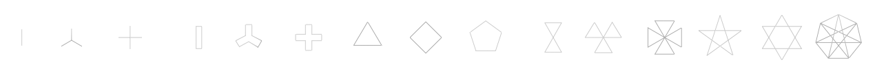
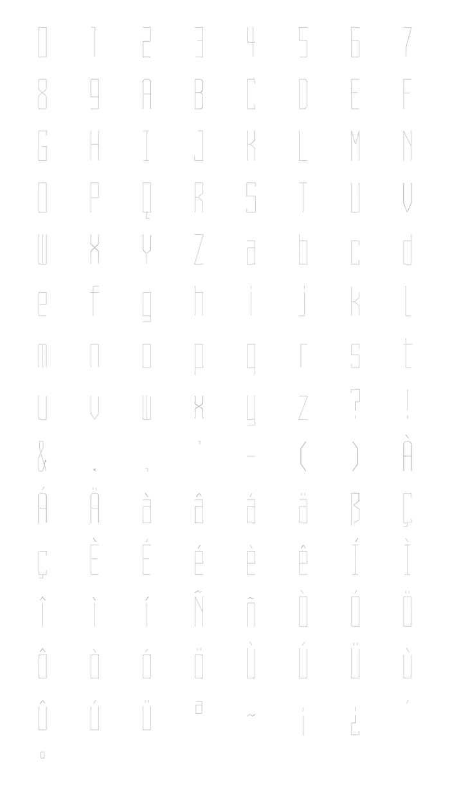
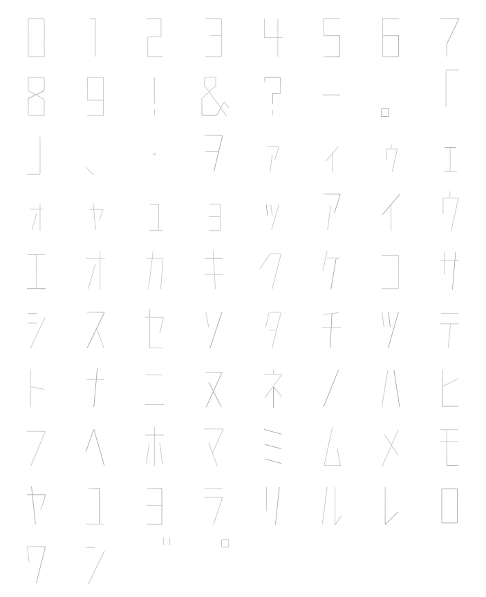

# TMD - PlayStation Model

Like every three-dimensional object in a video game, a character such as Vibri, would need a 3d model in order to convey what the player is doing. Despite previous confusion within the confines of the Vib-Ribbon community, this is no exception for Vibri. The format in which Vib-Ribbon uses for its models is the TMD format, which is useful for keeping filesize down in order to integrate Vib-Ribbon into the RAM of the Playstation. These files tend to be small to the point where multiple tens, or maybe even a couple hundred could theoretically fit inside the base 2 megabytes of system memory on the PlayStation.

Vib-Ribbon makes use of these model files rather extensively compared other games due to the visual style of the game. From characters, to the ribbon itself, to even the font that the game uses, everything that is a vector traces back to one of these models. However, if imported straight into a program, such as Blender, you’ll only get pieces of a model that aren’t put together. It’s up to the ANM files to put them together.

And because of the fact that the objects that make up each file are polylines, as opposed to polygons, they may render as invisible or otherwise incorrect or strange unless the user turns on some sort of wireframe mode.

## File Makeup

| Header | Object Table | Primitives | Vertices | Normals |
|:------:|:------------:|:----------:|:--------:|:-------:|

The short rundown of what each of the parts of the file do.

* The header indicates the version of the TMD, any flags that the TMD needs to set and the number of objects in the file.
* The object table, you guessed it, lists the pointers to all the objects.
* Primitives are arrangments of drawing packets, being: polygons, lines, and sprites.
* Vertices, obviously, are the points for all the objects.
* Normals help with shading, which is completely irrelevant for vib-ribbon.

## TMD Implementations
### Fonts
As stated before, all vector objects are loaded from TMD files, including the font files. The PAL version of the game uses one of two main font files depending on what the language is set to from the menu. An oddity that can be seen is that all of the Japanese files, including the katakana font, is still in the European version, inside `01_FILES`, but are left only used in the Japanese release.

Each `FONT` folder contains two TMDs, `FE_FONT.TMD` (`01_FONT.TMD` for Japanese) and `MARK.TMD`. The actual symbols used to make sentences are made from `FE_FONT.TMD`, whereas `MARK.TMD` contains shape-represenations for scoring. One thing to note is that the numbers saved in `01_FONT.TMD` are wider than they are in `FE_FONT.TMD`, probably because of the katakana also written in the Japanese file.

**MARK.TMD**

</img>
 

**FE_FONT.TMD**

</img>
 

**01_FONT.TMD**

</img>
 

### Vibri

There are three variants of Vibri's rabbit form inside of the games files, a different variant is used for each executable of the game. These three files, to reduce confusion, only contain Vibri’s rabbit form, as her other forms are located in other files. A major thing about Vibri's model to be known is that this one is not meant to be looked at from all directions, as this model takes a slightly more "two-dimensional" approach.

The one used for MAIN\_T is located in `TITLE\FILES\MOVIE\TITLE\`, which is a 8120-byte file named `VIBRI.TMD`. It is used for the title screen, and contains most of the same objects as MAIN\_G's Vibri model, with the exception of omitting a few of them, which seem to relate to arms.

MAIN\_G's Vibri rabbit model is a 8528-byte file titled two different things depending on where it comes from. As such, the same file is located in two different places at all times, `GAME\xx_FILES\TITLE\VIBRI\` and `GAME\xx_FILES\CHARA\PEELOO\`, where the files are named `VIBRI.TMD` and `MODEL.TMD` respectively. The former is used for the game menus, where the other is used for gameplay. During gameplay, the game also loads her other forms from the `FROG`, `SNAKE`, and `SUPER` folders, also located in `GAME\xx_FILES\CHARA\`, all of which also called `MODEL.TMD`. The folders also contain all the ANM files for the respective forms, as they of course, cannot share the same ones.

And finally, the third variant of the Vibri model is the smallest, being comprised of only 4400 bytes. This one is used during MAIN\_K's execution -- which is the tutorial. It is not only smaller in file size, but it is also curiously smaller in *physical* size. This file is located in `KIOSK\xx_FILES\MOVIE\KIOSK2\` and is named `MODEL.TMD`.

As stated before, Vibri's model has to adapt to the position of the camera as all of her limbs are flat, taking the camera to a different / unintended position reveals a few things about Vibri that suggest that the third dimension was used to help make certain details.

</img>
 

 Certain angles are still applied to some of the limbs of Vibri. In the example gif for example, you can notice how her feet and her arms are tilted, which is usually not though about when rendered into the game. Her torso is also a full cone-like structure rather than a plane like the rest of the model's objects.
  
Perhaps the most noticable, her eyes also pertrude from the rest of the face, likely as either a way to make them appear thinner than they really are, or to make them scale more naturally when turning. A final thing you may notice is the triangle that appears on her head. This might have been used as a way to help center the head during the animating process. This triangle of course, does not show up in the actual game.

</img>

 

In all of the models for Vibri, the eyes are only visible from one side because the PlayStation is able to hide any object from the backside.
